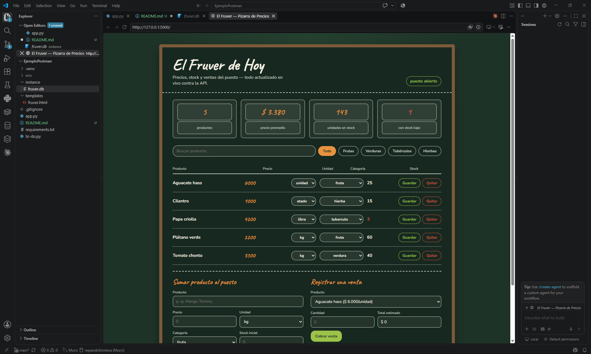
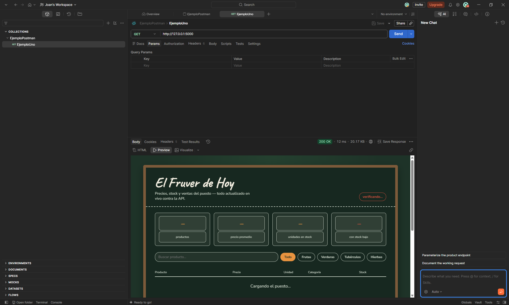
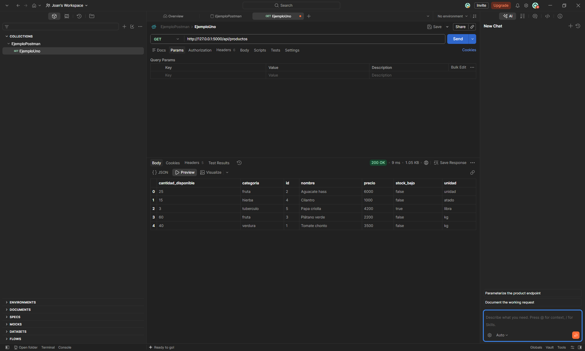
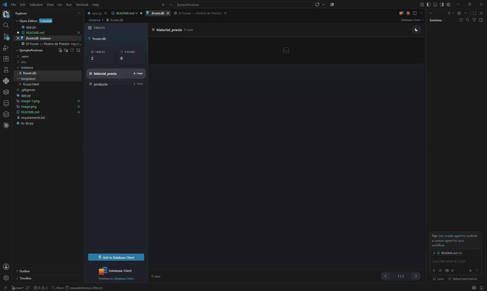

# Aplicación Flask - El Fruver (Gestión de Inventario)

Aplicación web desarrollada con Flask y SQLite que permite gestionar el inventario de un fruver (frutas, verduras y tubérculos): registrar productos, controlar precios, stock por categoría y registrar ventas, todo desde una interfaz web conectada a una API REST.

## Tecnologías usadas
- Python
- Flask
- Flask-SQLAlchemy (persistencia en SQLite)
- HTML / CSS / JavaScript (interfaz servida por Flask con `render_template`)
- Git / GitHub

## Requisitos previos
- Tener Python instalado
- Tener Git instalado

## Instrucciones de instalación y ejecución

### 1. Clonar el repositorio
```bash
git clone <https://github.com/Hatchedbot/ElFruver.git>
cd <ElFruver>
```

### 2. Crear entorno virtual
```bash
python -m venv env
```

### 3. Activar entorno virtual
```bash
env\Scripts\activate
```

### 4. Instalar librerías necesarias
```bash
pip install -r requirements.txt
```

### 5. Ejecutar la aplicación
```bash
python app.py
```

### 6. Abrir la aplicación
Con el servidor corriendo, abre en el navegador:
```
http://127.0.0.1:5000/
```

> La base de datos (`fruver.db`) se crea automáticamente la primera vez que se ejecuta la aplicación, con productos de ejemplo ya cargados.

## Estructura del proyecto
```
fruver_app/
├── app.py                 # API Flask (rutas CRUD, ventas, filtros) + modelos SQLAlchemy
├── requirements.txt        # Dependencias del proyecto
└── templates/
    └── fruver.html          # Interfaz web (pizarra de precios)
```

## Endpoints principales de la API

| Método | Ruta                              | Descripción                              |
|--------|-----------------------------------|-------------------------------------------|
| GET    | `/api/productos`                  | Lista todos los productos (admite filtros `?categoria=` y `?nombre=`) |
| GET    | `/api/productos/<id>`             | Obtiene un producto por ID                |
| POST   | `/api/productos`                  | Crea un nuevo producto                    |
| PUT    | `/api/productos/<id>`             | Actualiza un producto completo            |
| PATCH  | `/api/productos/<id>`             | Actualiza campos específicos de un producto |
| DELETE | `/api/productos/<id>`             | Elimina un producto                       |
| GET    | `/api/productos/<id>/historial`   | Consulta el historial de cambios de precio |
| POST   | `/api/productos/<id>/vender`      | Registra una venta y descuenta stock      |

## Probar la API con Postman

Con la aplicación corriendo (`python app.py`), puedes probar los endpoints desde Postman:

1. Abre Postman y crea una **colección** nueva (botón `+` junto a "Collections") y ponle un nombre, por ejemplo `FruverAPI`.
2. Dentro de la colección, crea un **request** nuevo (botón `+` o clic derecho sobre la colección → `Add request`).
3. Selecciona el método HTTP correspondiente (`GET`, `POST`, `PUT`, `PATCH` o `DELETE`) en el menú desplegable junto a la URL.
4. Pega la URL del endpoint que quieras probar, por ejemplo:
   ```
   http://127.0.0.1:5000/api/productos
   ```
5. Si el método es `POST`, `PUT` o `PATCH`, ve a la pestaña **Body**, selecciona `raw` y el formato `JSON`, y escribe los datos del producto, por ejemplo:
   ```json
   {
     "nombre": "Mango Tommy",
     "precio": 2500,
     "unidad": "kg",
     "categoria": "fruta",
     "cantidad_disponible": 10
   }
   ```
6. Haz clic en **Send** y revisa la respuesta en la parte inferior (código de estado, tiempo de respuesta y el JSON devuelto).
7. Guarda el request (`Ctrl+S`) para que quede dentro de la colección y puedas repetirlo después.

> Nota: la pestaña **Preview** de Postman sirve solo para ver HTML estático — no ejecuta el `fetch()` de la interfaz del fruver. Para ver la pizarra de precios funcionando, abre `http://127.0.0.1:5000/` directamente en el navegador, no en Postman.

## Control de versiones (comandos usados durante el desarrollo)

```bash
# Inicializar repositorio
git init

# Agregar cambios al staging
git add .

# Confirmar cambios
git commit -m "mensaje"

# Conectar con el repositorio remoto
git remote add origin <URL_DEL_REPOSITORIO>

# Subir cambios
git push -u origin main
```

## Evidencia de ejecución

[Evidencia de ejecución]





## Autor
Joan Sebastian Lara Fuenmayor - 506242012
