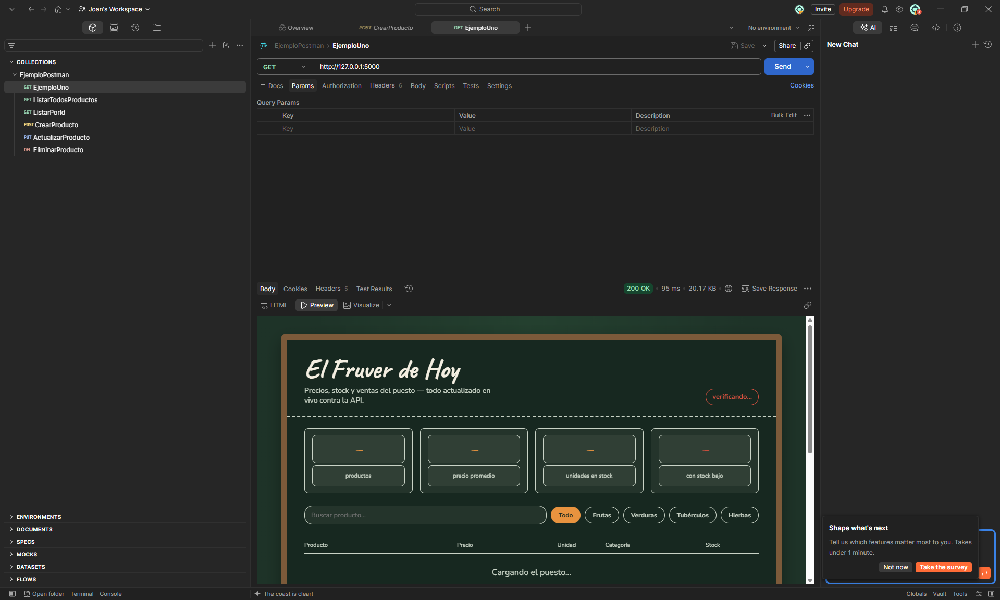
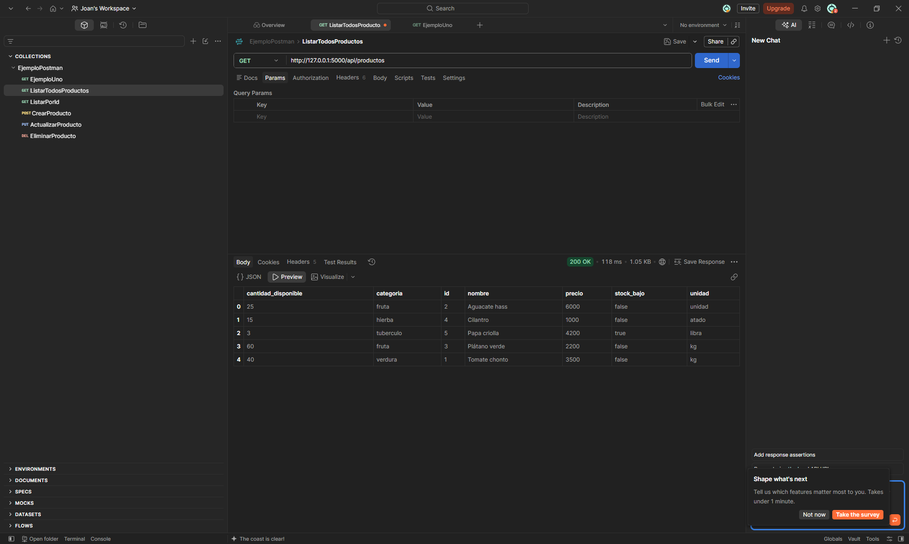
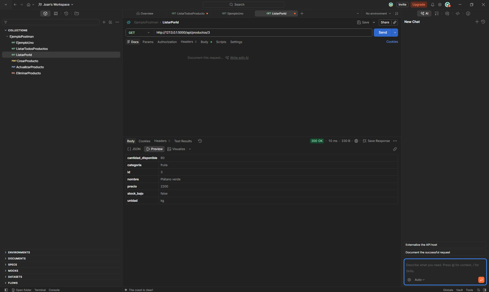
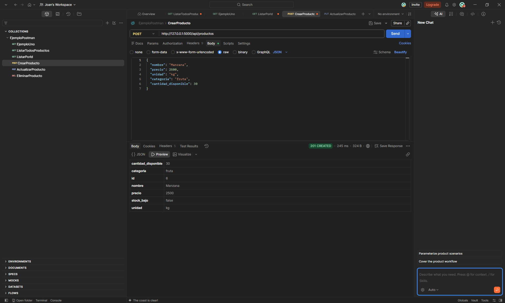
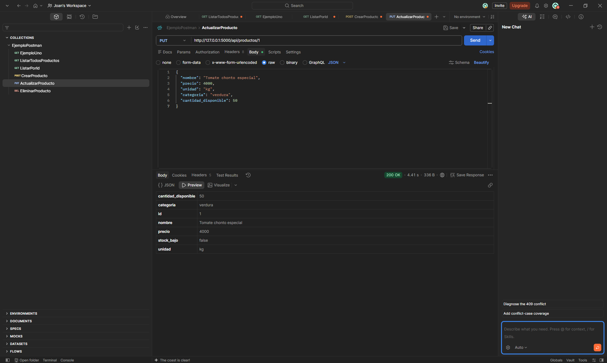
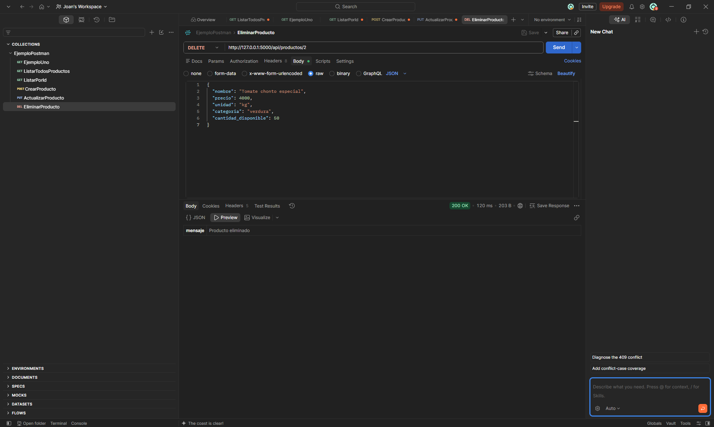

# Aplicación Flask - El Fruver (Gestión de Inventario)

Aplicación web desarrollada con Flask y SQLite que permite gestionar el inventario de un fruver (frutas, verduras y tubérculos): registrar productos, controlar precios, stock por categoría y registrar ventas, todo desde una interfaz web conectada a una API REST.

## Tecnologías usadas
- Python
- Flask
- Flask-SQLAlchemy (persistencia en SQLite)
- HTML / CSS / JavaScript (interfaz servida por Flask con `render_template`)
- Git / GitHub

## Requisitos previos
- Tener Python instalado
- Tener Git instalado

## Instrucciones de instalación y ejecución

### 1. Clonar el repositorio
```bash
git clone <URL_DEL_REPOSITORIO>
cd <NOMBRE_DEL_REPOSITORIO>
```

### 2. Crear entorno virtual
```bash
python -m venv env
```

### 3. Activar entorno virtual
```bash
env\Scripts\activate
```

### 4. Instalar librerías necesarias
```bash
pip install -r requirements.txt
```

### 5. Ejecutar la aplicación
```bash
python app.py
```

### 6. Abrir la aplicación
Con el servidor corriendo, abre en el navegador:
```
http://127.0.0.1:5000/
```

> La base de datos (`fruver.db`) se crea automáticamente la primera vez que se ejecuta la aplicación, con productos de ejemplo ya cargados.

## Estructura del proyecto
```
fruver_app/
├── app.py                 # API Flask (rutas CRUD, ventas, filtros) + modelos SQLAlchemy
├── requirements.txt        # Dependencias del proyecto
└── templates/
    └── fruver.html          # Interfaz web (pizarra de precios)
```

## Endpoints principales de la API

| Método | Ruta                              | Descripción                              |
|--------|-----------------------------------|-------------------------------------------|
| GET    | `/api/productos`                  | Lista todos los productos (admite filtros `?categoria=` y `?nombre=`) |
| GET    | `/api/productos/<id>`             | Obtiene un producto por ID                |
| POST   | `/api/productos`                  | Crea un nuevo producto                    |
| PUT    | `/api/productos/<id>`             | Actualiza un producto completo            |
| PATCH  | `/api/productos/<id>`             | Actualiza campos específicos de un producto |
| DELETE | `/api/productos/<id>`             | Elimina un producto                       |
| GET    | `/api/productos/<id>/historial`   | Consulta el historial de cambios de precio |
| POST   | `/api/productos/<id>/vender`      | Registra una venta y descuenta stock      |

## Probar la API con Postman

Con la aplicación corriendo (`python app.py`), puedes probar todos los endpoints desde Postman. Pasos generales para crear la colección:

1. Abre Postman y crea una **colección** nueva (botón `+` junto a "Collections") y ponle un nombre, por ejemplo `EjemploPostman`.
2. Dentro de la colección, crea un **request** nuevo por cada endpoint (botón `+` o clic derecho sobre la colección → `Add request`) y ponle un nombre descriptivo (`ListarTodosProductos`, `CrearProducto`, etc.).
3. Selecciona el método HTTP correspondiente (`GET`, `POST`, `PUT` o `DELETE`) en el menú desplegable junto a la URL.
4. Si el método es `POST` o `PUT`, ve a la pestaña **Body → raw**, y a la derecha cambia el formato de `Text` a **JSON** — esto agrega automáticamente el header `Content-Type: application/json`.
5. Haz clic en **Send** y revisa la respuesta abajo (código de estado, tiempo de respuesta y el JSON devuelto).
6. Guarda el request (`Ctrl+S`) para que quede dentro de la colección.

A continuación, el detalle de cada request usado en el taller:

### 0. Ejemplo general — vista de la interfaz
- **Método:** `GET`
- **URL:** `http://127.0.0.1:5000`
- Devuelve el HTML de la pizarra de precios (no lo confundas con los endpoints de la API — esta ruta sirve la interfaz, no datos JSON).



### 1. Listar todos los productos
- **Método:** `GET`
- **URL:** `http://127.0.0.1:5000/api/productos`
- No necesita Body. Devuelve un arreglo JSON con todos los productos registrados.



### 2. Listar un producto por ID
- **Método:** `GET`
- **URL:** `http://127.0.0.1:5000/api/productos/3`
- No necesita Body. El número al final de la URL es el `id` del producto que quieras consultar.



### 3. Crear un producto
- **Método:** `POST`
- **URL:** `http://127.0.0.1:5000/api/productos`
- **Body → raw → JSON:**
```json
{
  "nombre": "Manzana",
  "precio": 2500,
  "unidad": "kg",
  "categoria": "fruta",
  "cantidad_disponible": 30
}
```
- Respuesta esperada: `201 CREATED` con el producto creado (incluyendo el `id` que le asignó la base de datos).



### 4. Actualizar un producto completo
- **Método:** `PUT`
- **URL:** `http://127.0.0.1:5000/api/productos/1`
- **Body → raw → JSON:**
```json
{
  "nombre": "Tomate chonto especial",
  "precio": 4000,
  "unidad": "kg",
  "categoria": "verdura",
  "cantidad_disponible": 50
}
```
- Reemplaza todos los campos del producto con `id = 1`. Respuesta esperada: `200 OK` con el producto ya actualizado.



### 5. Eliminar un producto
- **Método:** `DELETE`
- **URL:** `http://127.0.0.1:5000/api/productos/2`
- No necesita Body (el DELETE actúa solo sobre el `id` de la URL). Respuesta esperada: `200 OK` con `{"mensaje": "Producto eliminado"}`.



> Nota: la pestaña **Preview** de Postman sirve solo para ver HTML estático — no ejecuta el `fetch()` de la interfaz del fruver. Para ver la pizarra de precios funcionando, abre `http://127.0.0.1:5000/` directamente en el navegador, no en Postman.

## Control de versiones (comandos usados durante el desarrollo)

```bash
# Inicializar repositorio
git init

# Agregar cambios al staging
git add .

# Confirmar cambios
git commit -m "mensaje"

# Conectar con el repositorio remoto
git remote add origin <URL_DEL_REPOSITORIO>

# Subir cambios
git push -u origin main
```

## Evidencia de ejecución

Capturas de cada endpoint probado en Postman (ver el detalle de cada una en la sección [Probar la API con Postman](#probar-la-api-con-postman)):

| Endpoint | Captura |
|---|---|
| Ejemplo general (interfaz) | `evidencia/01-ejemplo-general.png` |
| Listar todos los productos | `evidencia/02-listar-todos-productos.png` |
| Listar producto por ID | `evidencia/03-listar-producto-por-id.png` |
| Crear producto | `evidencia/04-crear-producto.png` |
| Actualizar producto | `evidencia/05-actualizar-producto.png` |
| Eliminar producto | `evidencia/06-eliminar-producto.png` |

Ejecucion En VisualStudio


## Autor
Joan Sebastian Lara Fuenmayor - 506242012
